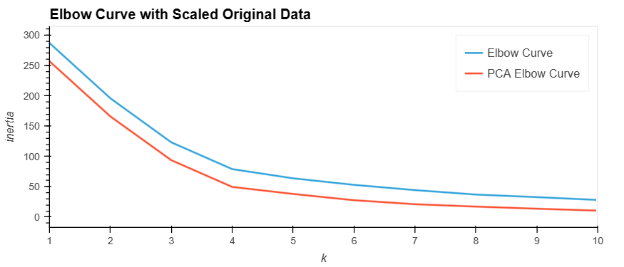
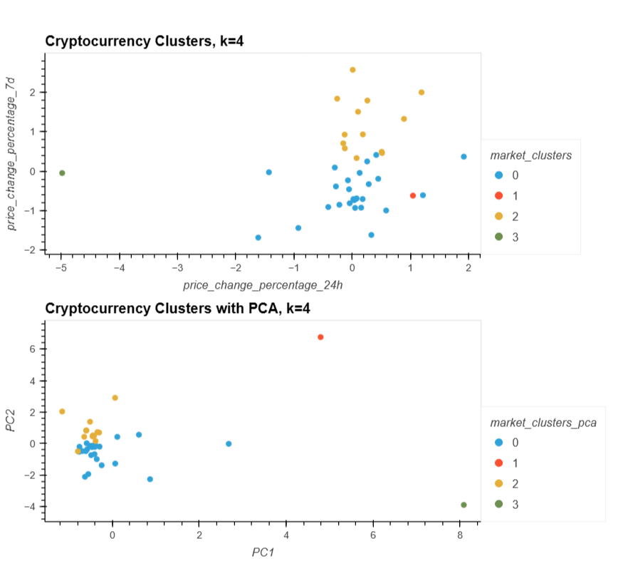

# CryptoClustering
## Overview
The Crypto Clustering project aims to predict if cryptocurrencies are affected by 24-hour or 7-day price changes using unsupervised learning techniques, specifically K-means clustering. Additionally, the project explores the impact of dimensionality reduction using Principal Component Analysis (PCA) on clustering.

## Steps
Using the provided data on Crypto Currencies, containing 7 features, I explored clustering the data. The analysis, plots, and code can be found in Crypto_Clustering.ipynb

* First, I normalized the data using StandardScaler() from scikit-learn.
* Using this data, I then used the elbow method to find the best value for k.
  * From the elbow method line chart, I determined that the best value for k is 4.
* I then fit the data with a k-means model to cluster the different crypto currencies into 4 groups then plotted the groups in a scatter plot.
* I then used Principal Component Analysis (PCA) to reduce the features down to 3.
  * The explained variance of these three features was 89%.
* I repeated the process of using the elbow method and fitting the data with a k-means model.
  * Using PCA and the elbow method, the best value of k was again determined to be 4, leading to the conclusion that PCA with 3 features was appropriate for this data set.
* Finally, I compared the the elbow curves and the scatter plots before and after PCA. Images are shown below.

## Plots

## Conclusion
In this case, using fewer features did not affect the number of clusters (k) as shown with the plot of the elbow curves. In the plot of the clusters, it is much more clear that groups 1 and 3 are very distinct from the rest of the crypto coins while clusters 1 and 2 seem to be very similar.d analysis goals.
Overall, using PCA made the outliers more obvious, however, it does not make clusters 1 and 2 appear more distinct, at least with the two dimensions shown.
## Dependencies
* Python
* pandas
* NumPy
* scikit-learn
* hvPlot

## License
This project is licensed under the MIT License.